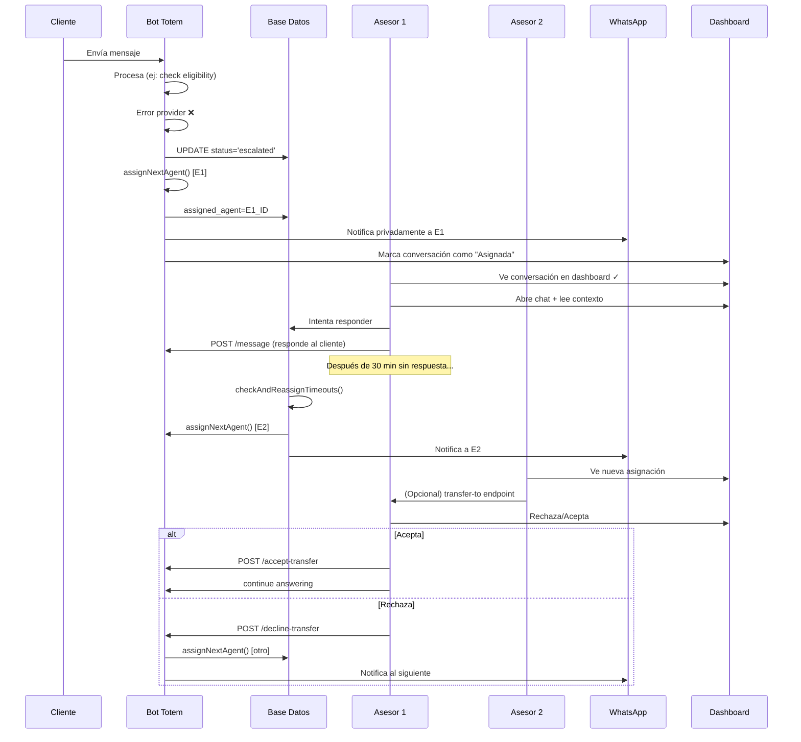

# Transferencia de Conversaciones entre Asesores - Guía Completa

## 1. Estado Actual del Sistema

### Arquitectura Existente

Tu sistema tiene:

- **Base de datos**: Campo `assigned_agent TEXT` en tabla `conversations`
- **Estados**: 
  - Phase: `escalated` (en state machine)
  - Status: `human_takeover` (en DB, cuando un humano toma control)
- **Eventos**: `escalation_triggered` y `agent_assigned`
- **Asignación**: Función `assignNextAgent()` con round-robin
- **Notificaciones**: Via WhatsApp al grupo "agent"

### Flujo Actual

```
Cliente envía mensaje
    ↓
Bot valida/procesa (ej: eligibility check)
    ↓
Si hay problema → Escala automáticamente
    ↓
Evento "escalation_triggered"
    ↓
Notificación WhatsApp a grupo "agent"
    ↓
Asesor toma manualmente: POST /conversations/:phone/takeover
    ↓
Asesor puede: enviar mensajes, guardar notas, subir contrato
```

**Problema**: No hay asignación automática prioritaria. La escalada solo notifica.

---

## 2. Implementar Asignación Automática en Escaladas

### Paso 1: Extender el Event Bus

Cuando se escala, disparar asignación automática:

```typescript
// apps/backend/src/bootstrap/event-bus-setup.ts

subscribe("escalation_triggered", async (event) => {
  if (event.type !== "escalation_triggered") return;
  
  const clientName = conversation?.client_name || "Cliente";
  await assignNextAgent(event.payload.phoneNumber, clientName);
});
```

### Paso 2: Modificar Command Type (Opcional pero Recomendado)

Agregar comandos de escalada y notificación en `packages/core/src/conversation/types.ts`:

```typescript
export type Command =
  | { type: "SEND_MESSAGE"; text: string }
  | {
      type: "SEND_IMAGES";
      category?: string;
      offset?: number;
      query?: string;
    }
  | { type: "SEND_BUNDLE"; bundleId: string }
  | { type: "TRACK_EVENT"; event: string; metadata?: Record<string, unknown> }
  // NUEVOS:
  | { type: "ESCALATE"; reason: string }
  | { type: "NOTIFY_TEAM"; message: string; to: "agents" | "supervisors" };
```

### Paso 3: Manejar Nuevos Comandos

En `apps/backend/src/conversation/handler/command-executor.ts`:

```typescript
export async function executeCommand(
  command: Command,
  phoneNumber: string,
  phase: ConversationPhase,
  metadata: ConversationMetadata,
  isSimulation: boolean,
): Promise<void> {
  switch (command.type) {
    case "SEND_MESSAGE":
      await sendMessage(phoneNumber, command.text, isSimulation);
      break;

    case "SEND_IMAGES":
      await executeImages(command, phoneNumber, phase, isSimulation);
      break;

    case "SEND_BUNDLE":
      await executeSingleBundle(command, phoneNumber, phase, isSimulation);
      break;

    case "TRACK_EVENT":
      trackEvent(phoneNumber, command.event, {
        segment: metadata.segment,
        ...command.metadata,
      });
      break;

    // NUEVOS:
    case "ESCALATE":
      // Emitir evento para que event-bus maneje la asignación
      eventBus.emit(
        createEvent("escalation_triggered", {
          phoneNumber,
          reason: command.reason,
          context: {
            phase: phase.phase,
          },
        })
      );
      break;

    case "NOTIFY_TEAM":
      // Notificar al equipo
      eventBus.emit(
        createEvent("team_notification", {
          phoneNumber,
          message: command.message,
          target: command.to,
        })
      );
      break;
  }
}
```

---

## 3. Enrutamiento de Conversaciones en Backend

### Nuevos Endpoints en `apps/backend/src/routes/conversations.ts`

```typescript
// Transferir a otro asesor específico
conversations.post("/:phone/transfer-to/:agentId", (c) => {
  const phoneNumber = c.req.param("phone");
  const agentId = c.req.param("agentId");
  const user = c.get("user");
  
  // Validar que el usuario actual es supervisor o admin
  if (!["admin", "supervisor"].includes(user.role)) {
    return c.json({ error: "Forbidden" }, 403);
  }
  
  const result = ConversationWrite.transferConversation(
    phoneNumber,
    agentId,
    user.id // quien ordena la transferencia
  );
  
  return c.json(result);
});

// Listar asesores disponibles
conversations.get("/agents/available", (c) => {
  const agents = ConversationRead.getAvailableAgents();
  return c.json(agents);
});

// Aceptar transferencia
conversations.post("/:phone/accept-transfer", (c) => {
  const phoneNumber = c.req.param("phone");
  const user = c.get("user");
  
  if (user.role !== "sales_agent") {
    return c.json({ error: "Only sales agents can accept transfers" }, 403);
  }
  
  const result = ConversationWrite.acceptTransfer(phoneNumber, user.id);
  return c.json(result);
});

// Rechazar transferencia
conversations.post("/:phone/decline-transfer", (c) => {
  const phoneNumber = c.req.param("phone");
  const user = c.get("user");
  
  const result = ConversationWrite.declineTransfer(phoneNumber, user.id);
  
  // Re-asignar a otro asesor
  if (result.success) {
    assignNextAgent(phoneNumber, result.clientName);
  }
  
  return c.json(result);
});
```

### Lógica de Transferencia

En `apps/backend/src/domains/conversations/write.ts`:

```typescript
export function transferConversation(
  phoneNumber: string,
  targetAgentId: string,
  initiatedBy: string
): { success: boolean; error?: string } {
  const conversation = db
    .prepare("SELECT * FROM conversations WHERE phone_number = ?")
    .get(phoneNumber) as any;

  if (!conversation) {
    return { success: false, error: "Conversation not found" };
  }

  const targetAgent = db
    .prepare("SELECT * FROM users WHERE id = ? AND role = 'sales_agent'")
    .get(targetAgentId) as any;

  if (!targetAgent) {
    return { success: false, error: "Agent not found" };
  }

  // Actualizar conversación
  db.prepare(
    `UPDATE conversations 
     SET assigned_agent = ?, status = 'human_takeover', assignment_notified_at = ?
     WHERE phone_number = ?`
  ).run(targetAgentId, Date.now(), phoneNumber);

  // Emitir evento de transferencia
  eventBus.emit(
    createEvent("conversation_transferred", {
      phoneNumber,
      from: conversation.assigned_agent,
      to: targetAgentId,
      initiatedBy,
      clientName: conversation.client_name,
      dni: conversation.dni,
    })
  );

  return { success: true };
}

export function acceptTransfer(
  phoneNumber: string,
  agentId: string
): { success: boolean; error?: string } {
  const conversation = db
    .prepare("SELECT * FROM conversations WHERE phone_number = ?")
    .get(phoneNumber) as any;

  if (!conversation) {
    return { success: false, error: "Conversation not found" };
  }

  if (conversation.assigned_agent !== agentId) {
    return { success: false, error: "This conversation is not assigned to you" };
  }

  db.prepare(
    `UPDATE conversations 
     SET assignment_notified_at = ?
     WHERE phone_number = ?`
  ).run(Date.now(), phoneNumber);

  eventBus.emit(
    createEvent("transfer_accepted", {
      phoneNumber,
      agentId,
      clientName: conversation.client_name,
    })
  );

  return { success: true };
}
```

---

## 4. Frontend: Dashboard de Asesores

### Nuevos Componentes Necesarios

```typescript
// apps/frontend/src/lib/utils/api.ts - Agregar helpers

export async function getAvailableAgents() {
  const response = await fetch("/api/conversations/agents/available");
  return response.json();
}

export async function transferConversation(
  phoneNumber: string,
  agentId: string
) {
  const response = await fetch(
    `/api/conversations/${phoneNumber}/transfer-to/${agentId}`,
    { method: "POST" }
  );
  return response.json();
}

export async function acceptTransfer(phoneNumber: string) {
  const response = await fetch(
    `/api/conversations/${phoneNumber}/accept-transfer`,
    { method: "POST" }
  );
  return response.json();
}
```

### Componente SvelteKit para Transferencia

```svelte
<!-- apps/frontend/src/routes/conversations/[phone]/+page.svelte -->

<script>
  import { transferConversation, getAvailableAgents } from "$lib/utils/api";

  let showTransferModal = false;
  let availableAgents = [];
  let selectedAgent = "";

  async function loadAgents() {
    const data = await getAvailableAgents();
    availableAgents = data;
  }

  async function handleTransfer() {
    if (!selectedAgent) return;
    
    const result = await transferConversation(phoneNumber, selectedAgent);
    if (result.success) {
      showTransferModal = false;
      toast.success("Conversación transferida");
    } else {
      toast.error(result.error);
    }
  }

  onMount(loadAgents);
</script>

<div class="conversation-controls">
  <button on:click={() => (showTransferModal = true)}>
    Transferir conversación
  </button>
</div>

{#if showTransferModal}
  <div class="modal">
    <h3>Transferir a otro asesor</h3>
    <select bind:value={selectedAgent}>
      <option value="">Seleccionar asesor...</option>
      {#each availableAgents as agent (agent.id)}
        <option value={agent.id}>
          {agent.name} {agent.is_available ? "✓" : "(No disponible)"}
        </option>
      {/each}
    </select>
    <button on:click={handleTransfer}>Confirmar transferencia</button>
    <button on:click={() => (showTransferModal = false)}>Cancelar</button>
  </div>
{/if}
```

---

## 5. Integración con API de Meta (WhatsApp Cloud API)

### 5.1 Arquitectura de Transferencia con Meta

Con la API de Meta, tienes varias opciones:

#### Opción A: Transferencia mediante etiquetas de grupo

```typescript
// apps/backend/src/adapters/whatsapp/transfer.ts

export async function transferConversationWithMeta(
  phoneNumber: string,
  toAgentPhone: string,
  clientName: string
) {
  const accessToken = process.env.WHATSAPP_ACCESS_TOKEN;
  const businessAccountId = process.env.WHATSAPP_BUSINESS_ACCOUNT_ID;

  // 1. Agregar etiqueta al chat
  const labelResponse = await fetch(
    `https://graph.instagram.com/v18.0/${businessAccountId}/labels`,
    {
      method: "POST",
      headers: { Authorization: `Bearer ${accessToken}` },
      body: JSON.stringify({
        name: `Asignado a ${clientName}`,
        description: `Transferido a agente: ${toAgentPhone}`,
      }),
    }
  );

  const label = await labelResponse.json();

  // 2. Aplicar etiqueta a la conversación
  await fetch(
    `https://graph.instagram.com/v18.0/${phoneNumber}/labels`,
    {
      method: "POST",
      headers: { Authorization: `Bearer ${accessToken}` },
      body: JSON.stringify({
        labels: [label.id],
      }),
    }
  );

  // 3. Notificar al nuevo agente
  await fetch(
    `https://graph.instagram.com/v18.0/${toAgentPhone}/messages`,
    {
      method: "POST",
      headers: { Authorization: `Bearer ${accessToken}` },
      body: JSON.stringify({
        messaging_product: "whatsapp",
        to: toAgentPhone,
        type: "text",
        text: {
          body: `Nueva asignación: ${clientName} (${phoneNumber})`,
        },
      }),
    }
  );
}
```

#### Opción B: Usar Webhook de Meta para Estado de Delivery

```typescript
// Cuando un asesor recibe y marca como leído el mensaje de notificación
// Meta envía webhook de delivery → sabemos que se enteró

webhook.on("message_status", (event) => {
  if (event.status === "read") {
    // Marcar como "en manos del agente"
    db.prepare(
      `UPDATE conversations SET status = 'handled_by_agent' 
       WHERE phone_number = ?`
    ).run(event.phoneNumber);
  }
});
```

### 5.2 Modelo de Datos Extendido

```sql
-- Agregar a schema.sql
ALTER TABLE conversations ADD COLUMN transferred_to_agent_at INTEGER;
ALTER TABLE conversations ADD COLUMN transfer_reason TEXT;
ALTER TABLE conversations ADD COLUMN previous_agent TEXT REFERENCES users(id);

CREATE TABLE IF NOT EXISTS agent_transfer_history (
    id TEXT PRIMARY KEY,
    conversation_phone TEXT NOT NULL REFERENCES conversations(phone_number),
    from_agent TEXT REFERENCES users(id),
    to_agent TEXT NOT NULL REFERENCES users(id),
    reason TEXT,
    timestamp INTEGER NOT NULL DEFAULT (unixepoch('now', 'subsec') * 1000),
    accepted_at INTEGER,
    declined_at INTEGER,
    created_by TEXT REFERENCES users(id)
);

CREATE INDEX IF NOT EXISTS idx_transfer_history_phone 
  ON agent_transfer_history(conversation_phone);
```

### 5.3 Endpoint Webhook para Meta

```typescript
// apps/backend/src/routes/webhook.ts

// Procesar cambios de estado de Meta
webhook.post("/whatsapp/status", async (c) => {
  const data = await c.req.json();

  // Meta reporta que un mensaje fue leído por el asesor
  if (data.entry?.[0]?.changes?.[0]?.value?.statuses) {
    for (const status of data.entry[0].changes[0].value.statuses) {
      if (status.status === "read") {
        // Confirmar que asesor vio la asignación
        db.prepare(
          `UPDATE conversations SET assignment_notified_at = ?
           WHERE phone_number = ?`
        ).run(Date.now(), status.recipient_id);

        eventBus.emit(
          createEvent("transfer_acknowledged", {
            phoneNumber: status.recipient_id,
          })
        );
      }
    }
  }

  return c.json({ received: true });
});
```

---

## 6. Flujo Completo: De Hoy a Con Meta API

### Hoy (Sin Meta API especializada):

```
1. Cliente envía mensaje
2. Bot escala (ej: eligibility fail)
3. assignNextAgent() → asigna round-robin
4. Se emite evento "agent_assigned"
5. Se notifica al grupo WhatsApp "agent"
6. Asesor ve notificación + entra al dashboard
7. Toma conversación manualmente o se abre automática

PROBLEMA: Múltiples asesores ven la notificación → confusión
```

### Mañana (Con Mejoras):

```
1. Cliente envía mensaje
2. Bot escala (ej: eligibility fail)
3. assignNextAgent() → asigna round-robin
4. transferConversation(agentId) con transición
5. EVENT: "conversation_transferred"
6. Solo ese asesor recibe notificación privada
7. Dashboard marca como "Asignada a ti"
8. Asesor acepta/rechaza
9. Si rechaza → re-asignar automáticamente

MEJORA: Claridad + mejor UX
```

### Con Meta Cloud API (Producción):

```
1. Cliente envía mensaje al número oficial de negocio
2. Bot procesa (en tu servidor)
3. Bot escala → assignNextAgent()
4. transferConversationWithMeta():
   - Etiqueta el chat en Meta
   - Notifica al asesor (por WhatsApp)
   - Registra en DB
5. Meta maneja el routing del chat en su UI
6. Asesor ve en Meta Business Suite/Dashboard
7. Cuando responde → tu webhook recibe el mensaje
8. Tu BD se actualiza

VENTAJA: Chat oficial de empresa + Meta maneja la historia
         Asesor trabaja en herramienta oficial de Meta
         Escalabilidad automática
```

---

## 7. Plan de Implementación

### Fase 1: Mejoras Inmediatas (Sin Meta API)
- [ ] Agregar subscriber en event-bus para auto-asignación
- [ ] Nuevos endpoints: `/transfer-to/:agentId`, `/accept-transfer`
- [ ] DB: `agent_transfer_history`
- [ ] Frontend: Modal de transferencia
- **Tiempo**: 1-2 días

### Fase 2: Comandos Opcionales
- [ ] Extender `Command` con `ESCALATE` y `NOTIFY_TEAM`
- [ ] Actualizar state machine phases si necesario
- **Tiempo**: 1 día (opcional)

### Fase 3: Meta API (Cuando esté lista)
- [ ] Autenticação con Meta (OAuth 2.0 + permanent token)
- [ ] Implementar `/transfer-to/:agentId` con meta sync
- [ ] Webhook para delivery status
- [ ] Testing con Business Account
- **Tiempo**: 2-3 días + testing

---

## 8. Archivos que Necesitarás Modificar

```
BACKEND:
  apps/backend/src/bootstrap/event-bus-setup.ts
  apps/backend/src/routes/conversations.ts
  apps/backend/src/domains/conversations/write.ts
  apps/backend/src/domains/conversations/read.ts
  apps/backend/src/conversation/handler/command-executor.ts
  apps/backend/src/db/schema.sql
  apps/backend/src/adapters/whatsapp/index.ts (NEW: transfer.ts)

CORE:
  packages/core/src/conversation/types.ts (agregar Command types)

FRONTEND:
  apps/frontend/src/lib/utils/api.ts
  apps/frontend/src/routes/conversations/[phone]/+page.svelte

CONFIG:
  (Nuevas variables de entorno para Meta API cuando sea necesario)
```

---

## 9. Ejemplo: Flujo de Transferencia Paso a Paso



---

## 10. Consideraciones de Seguridad

1. **Validar roles**: Solo supervisores pueden transferir
2. **Auditoría**: Registrar quién transfirió, cuándo, por qué
3. **Privacidad**: No compartir historial completo si no es necesario
4. **Rate limiting**: Evitar spam de transferencias
5. **Meta OAuth**: Usar refresh tokens seguros

---

## 11. Testing

```typescript
// apps/backend/tests/transfer.test.ts

test("transferir conversación a otro asesor", () => {
  const result = ConversationWrite.transferConversation(
    "+51999999999",
    "agent2_id",
    "supervisor_id"
  );
  
  expect(result.success).toBe(true);
  
  const conversation = db
    .prepare("SELECT assigned_agent FROM conversations WHERE phone_number = ?")
    .get("+51999999999");
  
  expect(conversation.assigned_agent).toBe("agent2_id");
});

test("rechazar transferencia -> re-asignar", async () => {
  // re-asignación automática
  const result = ConversationWrite.declineTransfer("+51999999999", "agent1_id");
  expect(result.success).toBe(true);
  
  // Debe haber sido asignada a alguien más
  const conv = db.prepare("SELECT assigned_agent FROM conversations WHERE phone_number = ?").get("+51999999999");
  expect(conv.assigned_agent).not.toBe("agent1_id");
});
```

---

## Resumen

| Aspecto | Hoy | Próximo | Con Meta |
|--------|-----|--------|----------|
| **Asignación** | Manual | Automática | Auto + Meta labels |
| **Notificación** | Grupo WhatsApp | Privada | Meta Business Suite |
| **Transferencia** | Via takeover | Transferencia explícita | Transferencia + Meta sync |
| **Historial** | En DB | BD + auditoria | BD + Meta API |
| **Escalabilidad** | Limitada | Media | Alta |

¿Con cuál fase quieres empezar?
